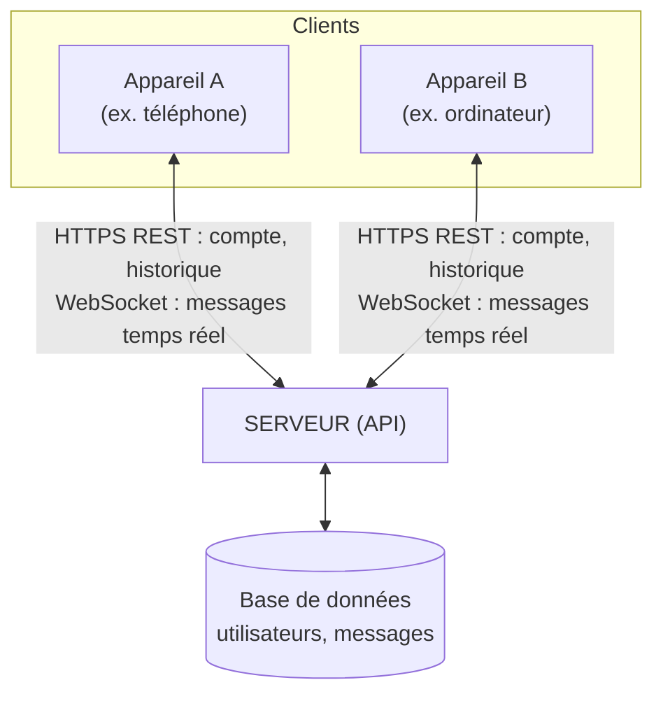

# Projet de Synthèse — Application de Messagerie Instantanée entre Deux Appareils

**Auteur :** Ralph Bou Nader  
**Formation :** Master — Ingénierie Informatique  
**Module :** API et Web Services  

---

## 1. Contexte et objectifs

Ce projet clôture le module **API et Web Services**. Il vous demande de concevoir et développer, de bout en bout, un système permettant à deux outils informatiques distincts — par exemple un téléphone et un ordinateur, ou plus concrètement deux clients logiciels distincts (une page web « mobile » et une page web « bureau », ou deux applications) — de s’échanger des messages en temps réel, par l’intermédiaire d’un serveur central que vous allez construire.

Ce projet n’introduit aucune notion nouvelle : il vous demande de combiner les briques vues séparément dans les chapitres précédents (HTTP, REST, formats JSON, WebSockets, sécurité) pour construire un système cohérent et fonctionnel — exactement la démarche d’un ingénieur API en situation réelle.

### Objectifs pédagogiques

- Concevoir une architecture client-serveur complète, avec persistance des données.
- Exposer une API REST pour les opérations classiques (comptes, historique).
- Mettre en œuvre un canal temps réel (WebSocket) pour la livraison immédiate des messages.
- Authentifier chaque client de façon sécurisée (JWT).
- Faire dialoguer deux clients réellement distincts, et non deux onglets du même navigateur par facilité.

---

## 2. Description fonctionnelle

Le système à construire est une messagerie minimale mais complète. Deux utilisateurs, chacun connecté depuis un appareil différent, doivent pouvoir :

1. **Créer un compte et s’authentifier.**
2. **Voir si l’autre utilisateur est actuellement connecté.**
3. **Envoyer un message texte à l’autre utilisateur.**
4. **Recevoir ce message instantanément sur l’autre appareil**, sans rafraîchir la page ni relancer l’application (rappel du Chapitre 6 — pourquoi le polling ne convient pas ici).
5. **Consulter l’historique des messages échangés**, y compris ceux envoyés avant leur connexion actuelle (donc persistés côté serveur, pas seulement en mémoire).

### 2.1. Scénario de démonstration attendu

Le jour de la soutenance, vous devrez faire la démonstration suivante, avec deux appareils physiquement différents (ou à défaut, deux navigateurs différents sur deux machines différentes — un téléphone et un ordinateur portable conviennent parfaitement) :

1. Connexion de l’« appareil A » avec le compte de l’utilisateur 1.
2. Connexion de l’« appareil B » avec le compte de l’utilisateur 2.
3. Envoi d’un message depuis A → apparition immédiate sur B, sans action de l’utilisateur sur B.
4. Envoi d’un message depuis B → apparition immédiate sur A.
5. Déconnexion puis reconnexion de A → l’historique complet de la conversation est toujours visible.

---

## 3. Architecture attendue

### Vue d’ensemble

```text
Appareil A (ex. téléphone)          Appareil B (ex. ordinateur)
       │                                   │
       │   HTTPS (REST : compte, historique)│
       │   WebSocket (messages temps réel)  │
       │                                   │
       └──────────────┬────────────────────┘
                      │
                SERVEUR (API)
                      │
               Base de données
            (utilisateurs, messages)
```



> **Point essentiel à respecter :** les deux appareils ne communiquent jamais directement entre eux. Tout transite par le serveur — c’est le serveur qui reçoit un message d’un client et le retransmet à l’autre. Ce choix architectural (rappel du Chapitre 1 — modèle client-serveur) simplifie considérablement le problème par rapport à une communication directe entre appareils (peer-to-peer), qui n’est pas demandée ici.

### Répartition REST / WebSocket — à respecter

Ce projet impose une séparation claire entre deux types d’opérations, sur le modèle vu en cours :

| Opération | Technologie à utiliser | Justification (rappel du cours) |
| :--- | :--- | :--- |
| **Création de compte, connexion** | REST (POST) | Opération ponctuelle, modèle requête-réponse classique (Chapitre 4) |
| **Récupération de l’historique des messages** | REST (GET) | Lecture d’une ressource identifiable par une URL (Chapitre 4) |
| **Liste des utilisateurs connectés** | REST (GET) | Consultation ponctuelle d’un état |
| **Envoi et réception de messages en direct** | WebSocket | Communication bidirectionnelle, faible latence, le serveur doit pouvoir pousser vers le client sans requête préalable (Chapitre 6) |

> [!IMPORTANT]
> **Question à traiter dans votre rapport :** pourquoi l’historique des messages (point 2 du tableau) est-il raisonnablement exposé en REST plutôt qu’entièrement via WebSocket ? Justifiez à partir des propriétés du modèle REST vues au Chapitre 4 (cache, ressource identifiable par une URL).

---

## 4. Spécifications techniques détaillées

### Modèle de données minimal

#### Utilisateur
| Champ | Type | Description |
| :--- | :--- | :--- |
| `id` | identifiant | Généré par le serveur |
| `username` | texte | Unique |
| `motDePasse` | texte (haché) | Jamais stocké en clair |

#### Message
| Champ | Type | Description |
| :--- | :--- | :--- |
| `id` | identifiant | Généré par le serveur |
| `expediteurId` | référence | Utilisateur qui envoie |
| `destinataireId` | référence | Utilisateur qui reçoit |
| `contenu` | texte | Le message lui-même |
| `dateEnvoi` | date/heure | Horodatage serveur, pas client |

---

### API REST à exposer (a minima)

| Méthode | URL | Rôle |
| :--- | :--- | :--- |
| `POST` | `/api/comptes` | Créer un compte |
| `POST` | `/api/auth/login` | S’authentifier, recevoir un JWT |
| `GET` | `/api/utilisateurs` | Lister les utilisateurs et leur statut (connecté / hors ligne) |
| `GET` | `/api/messages/{utilisateurId}` | Récupérer l’historique des messages avec un utilisateur donné |

> **Contrainte à respecter :** les endpoints ci-dessus (sauf création de compte et connexion) doivent être protégés par JWT, sur le modèle vu au Chapitre 7 et déjà pratiqué au TP4 — une requête sans jeton valide doit être rejetée avec `401 Unauthorized`.

---

### Canal WebSocket à exposer

- **Endpoint de connexion :** par exemple `wss://votreserveur.com/ws/messages`.
- **Authentification :** Le jeton JWT doit être transmis lors de la connexion (en paramètre de requête ou lors du handshake) pour identifier l’utilisateur — un client ne doit pas pouvoir se connecter au canal sans s’être préalablement authentifié en REST.
- **Format d’un message échangé sur le canal, à respecter :**
```json
{
  "type": "message",
  "expediteurId": 1,
  "destinataireId": 2,
  "contenu": "Bonjour !",
  "dateEnvoi": "2026-09-21T10:15:30"
}
```
- **Comportement du serveur :** Lorsqu’un client envoie un message sur le canal, le serveur doit :
  1. Le persister en base de données.
  2. Le retransmettre immédiatement au destinataire s’il est connecté sur le canal WebSocket.

> [!IMPORTANT]
> **Question à traiter dans votre rapport :** que doit faire le serveur si le destinataire n’est pas connecté au moment de l’envoi ? Proposez et justifiez un comportement (indice : le message doit-il être perdu ? Comparez avec la notion de persistance des événements vue à propos de Kafka au Chapitre 6, même si vous n’êtes pas tenu d’utiliser Kafka ici).

---

## 5. Contraintes techniques

- **Backend :** librement choisi, mais **Spring Boot** est recommandé pour rester cohérent avec les TP précédents (Spring Boot fournit un support WebSocket standard, `spring-boot-starter-websocket`).
- **Base de données :** une base relationnelle (MySQL, PostgreSQL) ou, à défaut, une base embarquée (H2) est acceptée pour la démonstration.
- **Format d’échange :** JSON exclusivement, conformément aux règles de syntaxe vues au Chapitre 3.
- **Clients :** Deux clients distincts et fonctionnels sont exigés :
  - Deux pages web responsives (une pensée « mobile », une pensée « bureau »), **OU**
  - Une page web et une application native/mobile simple.  
  *Le code de ces deux clients peut être très simple (HTML/JavaScript minimal) — l’essentiel du travail attendu porte sur le serveur et l’architecture, pas sur le design des interfaces.*

---

## 6. Fonctionnalités obligatoires vs bonus

### Fonctionnalités obligatoires (barème principal)

1. Création de compte et authentification par JWT.
2. Envoi et réception de messages en temps réel via WebSocket, entre deux clients distincts.
3. Persistance de tous les messages en base de données.
4. Récupération de l’historique via l’API REST.
5. Protection des endpoints REST sensibles par JWT (rappel du TP4).

### Fonctionnalités bonus (à choisir, au moins une pour la meilleure note)

- **Accusé de réception :** indiquer côté expéditeur si le message a été livré (« envoyé » / « livré » / « lu »).
- **Indicateur de saisie** (« Untel est en train d’écrire… »), transmis lui aussi via WebSocket.
- **Notification hors ligne :** si le destinataire n’est pas connecté, envoyer un Webhook vers un service tiers simulé (par exemple, afficher dans les logs serveur « notification envoyée à… », sur le modèle architectural du Chapitre 6).
- **Limitation de débit (rate limiting)** sur l’envoi de messages, pour éviter le spam — réutilisation directe du TP4.
- **Documentation OpenAPI/Swagger** de votre API REST — réutilisation directe du TP2.

---

## 7. Étapes de réalisation suggérées

Ce découpage est une suggestion, pas une obligation, pour vous aider à avancer progressivement :

| Étape | Contenu | Chapitres mobilisés |
| :---: | :--- | :--- |
| **1** | Modéliser les entités, mettre en place la base de données | Chapitre 3 (formats de données) |
| **2** | Construire l’API REST (comptes, historique) sans sécurité ni temps réel | Chapitre 4 (REST) |
| **3** | Ajouter l’authentification JWT sur l’API REST | Chapitre 7 (Sécurité) |
| **4** | Mettre en place le canal WebSocket et la retransmission en direct | Chapitre 6 (temps réel) |
| **5** | Relier les deux clients (mobile et bureau) au serveur, tester en conditions réelles | Chapitres 2, 3, 4, 6 |
| **6** | Ajouter une ou plusieurs fonctionnalités bonus | Selon le choix |

---

## 8. Livrables attendus

1. **Le code source complet** (serveur + deux clients), avec un fichier `README` expliquant comment lancer le projet.
2. **Un rapport écrit (5 à 8 pages)** incluant :
   - Un schéma d’architecture (sur le modèle de la Section « Vue d’ensemble »).
   - La justification de la répartition REST / WebSocket (question posée plus haut).
   - La réponse à la question sur la gestion d’un destinataire hors ligne.
   - Une description des choix techniques et des difficultés rencontrées.
   - Une capture d’écran de la démonstration (les deux appareils, avec un message visible sur chacun).
3. **Une démonstration en direct** (ou une vidéo si la soutenance est à distance), suivant le scénario décrit en Section 2.1, avec deux appareils physiquement distincts.

---

## 9. Modalités d’évaluation

| Critère | Points |
| :--- | :---: |
| Architecture générale (séparation REST/WebSocket respectée) | 4 |
| API REST fonctionnelle (comptes, historique) | 3 |
| Authentification JWT correctement mise en œuvre | 3 |
| Communication WebSocket fonctionnelle entre deux clients distincts | 5 |
| Persistance des messages en base de données | 2 |
| Fonctionnalité bonus implémentée | 2 |
| Qualité du rapport et clarté des réponses aux questions posées | 1 |
| **Total** | **20** |

---

## 10. Conseils

- Commencez par faire fonctionner l’API REST seule, testée dans Postman, avant d’ajouter le WebSocket — ne mélangez pas les difficultés.
- Testez le canal WebSocket d’abord avec un simple client de test (ex. l’extension Postman qui supporte désormais les WebSockets, ou un petit script), avant de le relier à vos deux vraies interfaces.
- Un « appareil » n’a pas besoin d’être un vrai smartphone : deux navigateurs lancés sur deux ordinateurs différents du même réseau suffisent largement pour démontrer que la communication ne passe pas par une simple variable partagée en mémoire côté client.
